# Manual: Implementación C-Agent

> **Versión:** v20  
> **Fecha:** 29-04-2026 

<!-- Estilos globales para tablas -->
<!-- <style>
  /* Estilos para thead */
  thead {
    background-color: black;
    color: white;
  }
  
  /* Estilos para tbody */
  tbody {
    background-color: gray;
    color: black;
    font-weight: bold;
  }
  
  /* Primera celda de cada fila en tbody */
  tbody tr td:first-child {
    font-weight: bold;
    text-align: center;
  }
  
  /* Clases para tipos de entorno */
  .dev {
    background-color: #87A96B !important;
  }
  .prod {
    background-color: #E1AD01 !important;
  }
  .unique {
    background-color: #E2725B !important;
  }
  .secret-optional{
    background-color: orange !important;
  }
  .secret-deprecated{
    background-color: #eed202 !important;
    color: red;
  }
  .table-inner-title{
    text-align:center;
    background-color: black;
    color:white;
  }
</style> -->
---
## Prerrequisitos
- Instalar [Docker Desktop](https://www.docker.com/products/docker-desktop/) (Elige la versión correspondiente a tu SO)
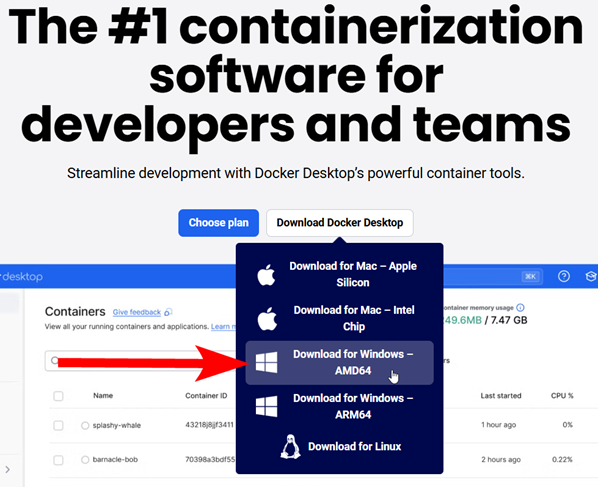

El uso de docker será para el despliegue o actualizaciones para el C-Agent en casos particulares. En otras palabras, algún cambio en su funcionamiento, para modificar el proyecto será necesario el uso de comandos que nos permiten el despliegue una nueva imagen.

---

## Recursos necesarios
<table>
  <thead>
    <tr>
      <th>Use</th>
      <th>Type</th>
      <th>Name</th>
      <th>Location</th>
      <th>Tier (Initial)</th>
      <th>Notes</th>
    </tr>
  </thead>
  <tbody>
    <tr class="dev">
      <td>Dev</td>
      <td>Azure Bot</td>
      <td>abot-cagent-02-%RANDOM%</td>
      <td>Global</td>
      <td>S1 Standard</td>
      <td>Managed Identity</td>
    </tr>
    <tr class="dev">
      <td>Dev</td>
      <td>Web App</td>
      <td>app-cagent-02-%RANDOM%</td>
      <td>TBD</td>
      <td>Check App Service Plan asp-cagent-02</td>
      <td>Linux, publish container, managed identity, "Reader KV2" rol</td>
    </tr>
    <tr class="dev">
      <td>Dev</td>
      <td>Key Vault</td>
      <td>kv-cagent-02-%RANDOM%</td>
      <td>TBD</td>
      <td>Standard</td>
      <td></td>
    </tr>
    <tr class="dev">
      <td>Dev</td>
      <td>App Service Plan</td>
      <td>asp-cagent-02-%RANDOM%</td>
      <td>TBD</td>
      <td>B2 Basic</td>
      <td></td>
    </tr>
    <tr class="dev">
      <td>Dev</td>
      <td>Azure Storage Account</td>
      <td>sacagent02%RANDOM%</td>
      <td>TBD</td>
      <td>Standard</td>
      <td></td>
    </tr>
    <tr class="prod">
      <td>Prod</td>
      <td>Azure Bot</td>
      <td>abot-cagent-01-%RANDOM%</td>
      <td>Global</td>
      <td>S1 Standard</td>
      <td>Managed Identity</td>
    </tr>
    <tr class="prod">
      <td>Prod</td>
      <td>Web App</td>
      <td>app-cagent-01-%RANDOM%</td>
      <td>TBD</td>
      <td>Check App Service Plan asp-cagent-01</td>
      <td>Linux, publish container, managed identity, "Reader KV2" rol</td>
    </tr>
    <tr class="prod">
      <td>Prod</td>
      <td>Key Vault</td>
      <td>kv-cagent-01-%RANDOM%</td>
      <td>TBD</td>
      <td>Standard</td>
      <td></td>
    </tr>
    <tr class="prod">
      <td>Prod</td>
      <td>App Service Plan</td>
      <td>asp-cagent-01-%RANDOM%</td>
      <td>TBD</td>
      <td>Premium v3 P1V3</td>
      <td></td>
    </tr>
    <tr class="prod">
      <td>Prod</td>
      <td>Azure Storage Account</td>
      <td>sacagent01%RANDOM%</td>
      <td>TBD</td>
      <td>Standard</td>
      <td></td>
    </tr>
    <tr class="unique">
      <td>Unique</td>
      <td>Container Registry</td>
      <td>accragent-%RANDOM%</td>
      <td>TBD</td>
      <td>Standard</td>
      <td></td>
    </tr>
    <tr class="unique">
      <td>Unique</td>
      <td>Azure Cosmos DB account</td>
      <td>cosmos-cagent-%RANDOM%</td>
      <td>TBD</td>
      <td>Provisioned throughput</td>
      <td>Azure cosmos DB for NoSQL, Provisioned throughput </td>
    </tr>
    <tr class="unique">
      <td>Unique</td>
      <td>Azure Foundry</td>
      <td>openai-cagent-%RANDOM%</td>
      <td>TBD</td>
      <td></td>
      <td>Deploy GPT-4.1 Global Estandar.</td>
    </tr>
    <tr class="unique">
      <td>Unique</td>
      <td>Log Analytics workspace</td>
      <td>logagent-%RANDOM%</td>
      <td>TBD</td>
      <td>Pay as you go</td>
      <td></td>
    </tr>
  </tbody>
</table>

---

## Funcionamiento de cada recurso
### Azure Bot
El servicio de Azure Bot nos permite comunicar usando distintos servicios: email, WhatsApp, Microsoft Teams, entre otros. Aquí se puede configurar el icono y el nombre del Bot.
### Web App
Es un servicio de Azure App Service que permite desplegar y alojar aplicaciones web de forma rápida, segura y escalable, sin necesidad de administrar infraestructura.
Aquí tendremos el Backend de nuestro Bot, por lo tanto, aquí se realizan los despliegues.
Para usar una Web App necesitamos tener un App Service Plan.
### Key Vault
Es un servicio de Azure diseñado para gestionar de forma segura secretos, claves de cifrado y certificados. **Su propósito principal es proteger información sensible que las aplicaciones necesitan para funcionar**, como:
  - Cadenas de conexión
  - Contraseñas
  - Claves de cifrado (simétricas y asimétricas)
  - Certificados SSL/TLS
No puede existir un Key Vault que suministre a varias Web Apps.
 ¿Por qué? Motivos de arquitectura en el C-Agent. Por lo tanto, es obligatoriamente tener un Key Vault por cada Web App.
### App Service Plan
Define los recursos de cómputo (CPU, memoria, escalabilidad, etc.) que se asignan a una o varias aplicaciones web hospedadas en Azure App Service.
Puede crecer tanto vertical como horizontalmente.
### Storage Account
Es un contenedor lógico que te permite almacenar datos de manera segura, escalable y altamente disponible.
Aquí guardaremos archivos que nos darán el contexto al Bot. Se puede guardar blobs para archivos típicos como .txt, .pdf entre otros. Además, las gráficas que se generan se guardan aquí.
### Container Registry
Es un servicio de Azure que te permite almacenar y administrar imágenes de contenedores privadas, como las que se usan con Docker o OCI (Open Container Initiative).
### Azure Cosmos DB
Es un servicio de base de datos NoSQL distribuida globalmente, diseñado para ofrecer alta disponibilidad, baja latencia y escalabilidad automática.
Aquí se guardará el historial de todas las conversaciones que tendremos con el Bot.
### Azure Foundry
Es una oferta de plataforma como servicio (PaaS) que unifica infraestructura, modelos, agentes y herramientas en un entorno seguro y productivo.
Aquí damos de alta los modelos de open AI y sus respectivas configuraciones.
### Log Analytics Workspace
Permite recopilar, almacenar, consultar y analizar datos de diagnóstico y telemetría de tus recursos en Azure. Aquí podemos monitorear los logs de todo el grupo de recursos.

---

## Aislamiento de entornos
**Es recomendable tener dos ambientes con sus respectivos recursos:**
<table>
  <thead>
    <tr>
      <th><b>Use</b></th>
      <th><b>Type</b></th>
    </tr>
  </thead>
  <tbody>
    <tr class="dev">
      <td>Dev</td>
      <td>Azure Bot</td>
    </tr>
    <tr class="dev">
      <td>Dev</td>
      <td>Web App</td>
    </tr>
    <tr class="dev">
      <td>Dev</td>
      <td>Key Vault</td>
    </tr>
    <tr class="dev">
      <td>Dev</td>
      <td>App Service Plan</td>
    </tr>
    <tr class="dev">
      <td>Dev - Unique</td>
      <td>Storage Account</td>
    </tr>
    <tr class="prod">
      <td><b>Prod</b></td>
      <td>Azure Bot</td>
    </tr>
    <tr class="prod">
      <td><b>Prod</b></td>
      <td>Web App</td>
    </tr>
    <tr class="prod">
      <td><b>Prod</b></td>
      <td>Key Vault</td>
    </tr>
    <tr class="prod">
      <td><b>Prod</b></td>
      <td>App Service Plan</td>
    </tr>
    <tr class="prod">
      <td><b>Prod - Unique</b></td>
      <td>Storage Account</td>
    </tr>
    <tr class="unique">
      <td>Unique</td>
      <td>Container Registry</td>
    </tr>
    <tr class="unique">
      <td>Unique</td>
      <td>Azure Cosmos DB Account</td>
    </tr>
    <tr class="unique">
      <td>Unique</td>
      <td>Azure Foundry</td>
    </tr>
    <tr class="unique">
      <td>Unique</td>
      <td>Log Analytics Workspace</td>
    </tr>
  </tbody>
</table>

---

## Creación de imagen
### Prerrequisitos:
- Necesitaremos haber creado previamente el recurso “Container Registry”. Esta es la imagen que se carga en el recurso "Web App”.
	- Necesitamos obtener la URL del servidor y el usuario/contraseña del "Container Registry"
	- Accedemos a estos datos ingresando al recurso "Container Registry" y luego al apartado "Configuraciones/Llaves de acceso"
- Clonar el código del C-Agent del repositorio en local.

Es necesario acceder al código. Iniciar sesión al servidor de Azure, crear la imagen (build) y luego cargarla (push).
### Comandos

`````bash
cd .\cagent_code\
cd .\source\

docker login [URL_servidor] #Después de ejecutar este comando, nos pedira usuario y contraseña
Username: [NombreUsuario]
Password: [Contraseña]

# Una vez autenticados vamos a crear y subir la nueva imagen del C-Agent

# Creación de la imagen
docker build -t [URL_servidor]/[Id_Nombre]:v[Version] .
# Ejemplo: docker build -t azureresource.azurecr.io/cagent:v20 .

# Cargar la imagen
docker push [URL_servidor]/[Id_Nombre]:v[Version]
# Ejemplo: docker push azureresource.azurecr.io/cagent:v20
`````


## Creación de recursos
### Web App
En la búsqueda del recurso debe aparecer un elemento justo como lo siguiente:
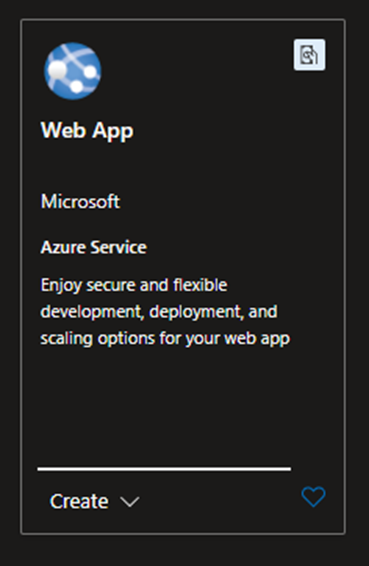

Una vez al darle “_Create_”, nos va a dirigir a la siguiente pantalla:
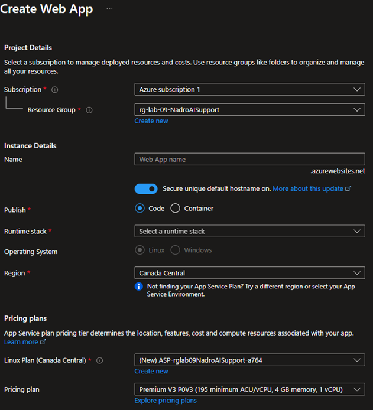
Campos requeridos:
<table>
  <thead style="background-color: black; color:white;">
    <tr>
      <th>Nombre</th>
      <th>Configuración</th>
    </tr>
  </thead>
  <tbody style="background-color: gray; color:black;font-weight: bold;">
    <tr>
      <td>Subscription</td>
      <td>Elegimos la suscripción para nuestra Web App</td>
    </tr>
    <tr>
      <td>Resource Group</td>
      <td>Elegimos el grupo de recursos donde estará la web app</td>
    </tr>
	<tr>
      <td>Name</td>
      <td>Nombre de la web app. Sigamos la nomenclatura definida, en este caso: app-cagent-XX-%RANDOM%</td>
    </tr>
	<tr>
      <td>Secure unique default hostname on.</td>
      <td>
	  	Deshabilitar.<br>
		Al habilitarse, se configura una url aleatoria.
		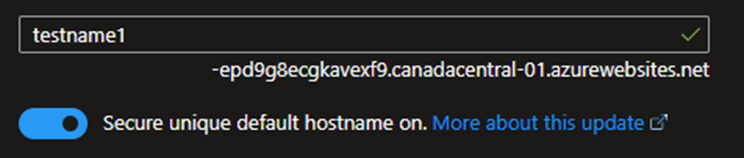
	  </td>
    </tr>
	<tr>
      <td>Publish</td>
      <td>Container</td>
    </tr>
	<tr>
      <td>Operating System</td>
      <td>Linux</td>
    </tr>
	<tr>
      <td>Region</td>
      <td>Definimos la región: East US, East US 2, South Central US</td>
    </tr>
	<tr>
      <td>Linux Plan</td>
      <td>Elegimos el App Service Plan ya creado o lo podemos crear desde ahí mismo</td>
    </tr>
  </tbody>
</table>                                                                            

### Configuración: Enviroment variables
Buscamos **Settings** y luego nos dirigimos a **environment variables**.
Seleccionamos Add.
<table>
  <thead>
    <tr>
      <th>Name</th>
      <th>Value</th>
    </tr>
  </thead>
  <tbody>
    <tr>
      <td>AZURE_KEYVAULT_NAME</td>
      <td>kv-cagent-XX-%RANDOM%</td>
    </tr>
  </tbody>
</table>

### Configuración Obligatoria: Agregar los roles
Buscamos **Settings** y luego nos dirigimos a **Identity**. Allí necesitaremos habilitar la única opción “Status”.
Después necesitaremos darle clic en el botón de “Azure role assignments”. Necesitaremos los siguientes roles:

<table>
  <thead>
    <tr>
      <th>Rol</th>
      <th>Resource Name </th>
      <th>Resource Type</th>
    </tr>
  </thead>
  <tbody>
    <tr>
      <td>AcrPull</td>
      <td>accragent-%RANDOM%</td>
      <td>Container Registry</td>
    </tr>
    <tr>
      <td>Key Vault Administrator</td>
      <td>kv-cagent-XX-%RANDOM%</td>
      <td>Key vault</td>
    </tr>
    <tr>
      <td>AZURE_KEYVAULT_NAME</td>
      <td>kv-cagent-XX-%RANDOM%</td>
      <td>Key vault</td>
    </tr>
  </tbody>
</table>

### Configuración Obligatoria: Comunicación entre Web app y el Bot
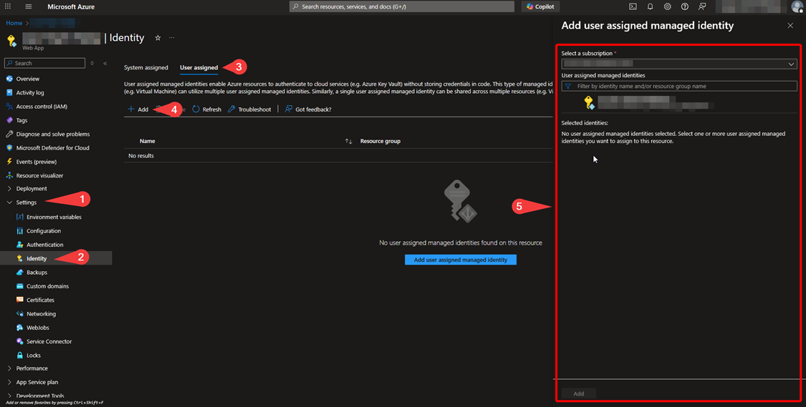
1. Buscamos la sección de **“Settings”**.
2. Buscamos la opción de **“Identity”**.
3. Damos clic en el tabulador de “User Assigned”
4. Damos clic en el botón de “+ Add” para que nos muestre un modal de lado derecho.
5. Aquí buscamos el recurso del bot que tiene su nombre de acuerdo con la nomenclatura anteriormente definida. Ej. abot-cagent-XX-%RANDOM%. La seleccionamos y listo damos clic en el botón “Add”.

### Configuración Obligatoria: Despliegue mediante "Container Registry"
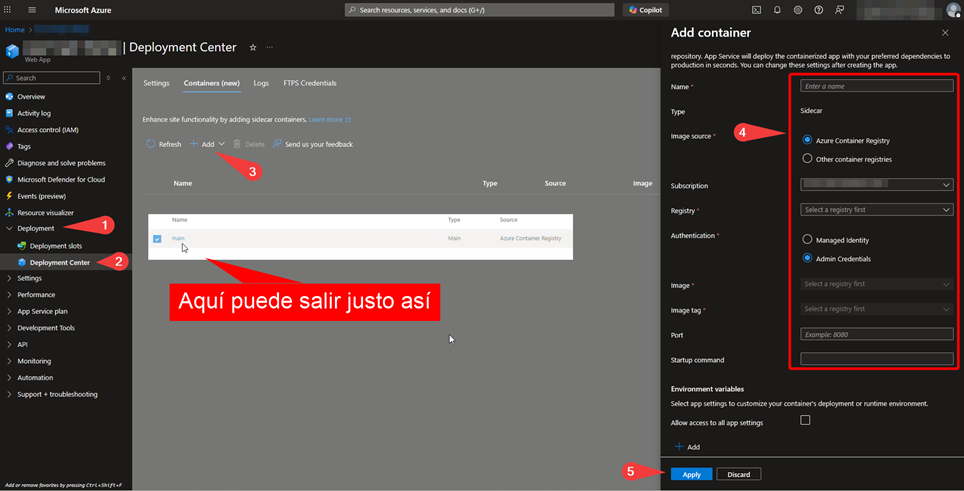
1. Nos vamos a la sección de “Deployment”.
2. Buscamos Deployment Center.
3. Aquí puede salir como en la anterior imagen donde haya un elemento llamado “main”. Damos clic o lo agregamos dando clic en “+ Add”.
4. Nos aparecerá un modal al lado derecho.
5. Modificamos los valores como en la tabla de abajo.
6. Damos en clic en “Apply”.

<table>
  <thead>
    <tr>
      <th>Campo</th>
      <th>Configuración</th>
    </tr>
  </thead>
  <tbody>
    <tr>
      <td>Name</td>
      <td>Main</td>
    </tr>
    <tr>
      <td>Type</td>
      <td>Main</td>
    </tr>
    <tr>
      <td>Image Source</td>
      <td>Azure Container Registry</td>
    </tr>
    <tr>
      <td>Subscription</td>
      <td>Elegimos la suscripción para nuestro recurso</td>
    </tr>
    <tr>
      <td>Registry</td>
      <td>Elegimos el recurso del Container Registry (accragent-%RANDOM%)</td>
    </tr>
    <tr>
      <td>Authentication</td>
      <td>Admin Credentials</td>
    </tr>
    <tr>
      <td>Image</td>
      <td>cagent</td>
    </tr>
    <tr>
      <td>Image Tag</td>
      <td>v20</td>
    </tr>
    <tr>
      <td>Port</td>
      <td>8000</td>
    </tr>
    <tr>
      <td>Startup Command</td>
      <td></td>
    </tr>
  </tbody>
</table>

---
### App Service Plan
Así aparece el elemento en el buscador.
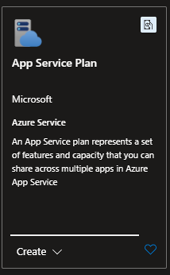

Una vez al darle “_Create_”, nos va a dirigir a la siguiente pantalla:
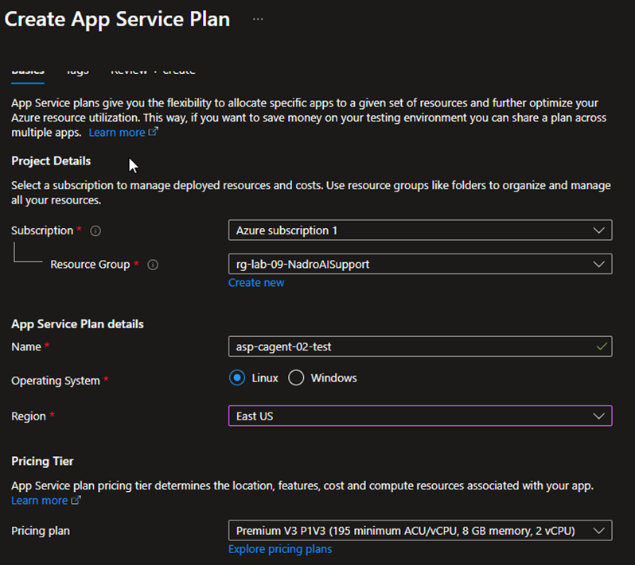
<table>
  <thead>
    <tr>
      <th>Campo</th>
      <th>Configuración</th>
    </tr>
  </thead>
  <tbody>
    <tr>
      <td>Subscription</td>
      <td>Elegimos la subscripción para nuestro recurso</td>
    </tr>
    <tr>
      <td>Resource Group</td>
      <td>Elegimos el grupo de recursos donde estará el App Service Plan</td>
    </tr>
    <tr>
      <td>Name</td>
      <td>Nombre del Plan. Sigamos la nomenclatura definida, en este caso: asp-cagent-XX-%RANDOM%</td>
    </tr>
    <tr>
      <td>Operating System</td>
      <td>Linux</td>
    </tr>
    <tr>
      <td>Region</td>
      <td>Puede ser East US, East US 2 o South Central US</td>
    </tr>
    <tr>
      <td>Pricing Plan</td>
      <td>Dependiendo el entorno.<br>
	  Dev: Basic.<br>
	  Producción: Premium/Legacy
	  </td>
    </tr>
  </tbody>
</table>

> [!NOTE]
> Para el ambiente Dev/QA es necesario un B: puede ser B1, B2 o B3. Es importante solo para su uso de testing o QA. IMPORTANTE: si se activa la versión FREE se limitará el tiempo de uso a 1 hora por día. Utilizar mínimo versión B1.

> [!IMPORTANT]
> Para producción no utilizar un B por su falta de soporte de Microsoft. Es decir, Microsoft no tendrá disponibilidad en caso necesario si tenemos asignado un B. 
>
> **Recomendación:** Tier – Premium v3 P1V3. Se encuentra en la sección de `Production`.

---
### Azure Bot
Así aparece en el buscador:
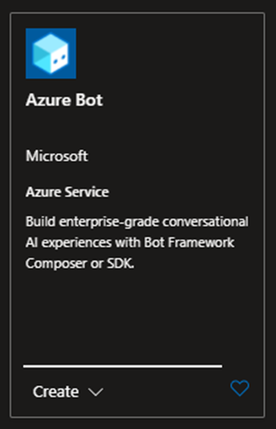

Una vez al darle `Create`, nos va a dirigir a la siguiente pantalla:
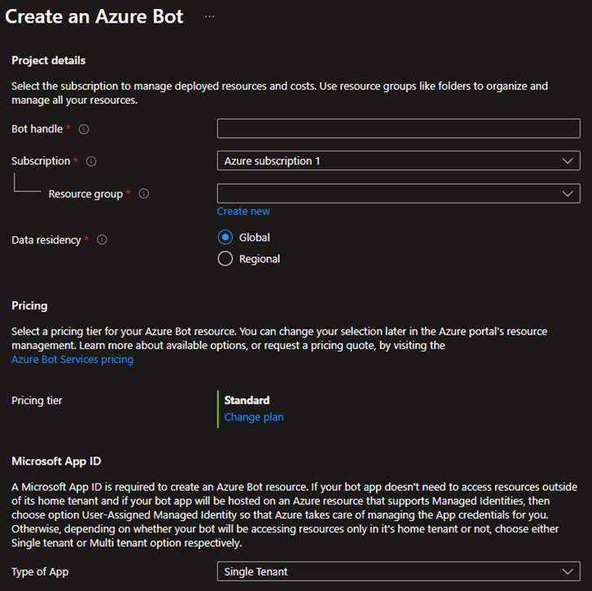

<table>
  <thead>
    <tr>
      <th>Campo</th>
      <th>Configuración</th>
    </tr>
  </thead>
  <tbody>
    <tr>
      <td>Bot handle</td>
      <td>Nombre del Bot. Sigamos la nomenclatura definida, en este caso: <b>abot-cagent-XX-%RANDOM%</b></td>
    </tr>
    <tr>
      <td>Subscription</td>
      <td>Elegimos la subscripción para nuestro recurso</td>
    </tr>
    <tr>
      <td>Resource Group</td>
      <td>Elegimos el grupo de recursos donde estará el Azure Bot</td>
    </tr>
    <tr>
      <td>Data residency</td>
      <td>Global</td>
    </tr>
    <tr>
      <td>Pricing tier</td>
      <td>Para Dev: Free y para QA/Produccion: Standard S1</td>
    </tr>
    <tr>
      <td>Type of App</td>
      <td>User-Assigned Managed Identity</td>
    </tr>
    <tr>
      <td>Creation Type</td>
      <td>Create a new Microsoft App ID</td>
    </tr>
  </tbody>
</table>

> [!IMPORTANT]  
> **Si al momento de crear el Bot no nos permite crearlo, necesitaremos que un rol superior al nuestro lo cree o pedir privilegios al administrador de la subscripción.**

#### Cambiar la imagen y nombre del Bot
Nos dirigimos a **Settings** y luego a **Bot Profile**
Allí tenemos que editar los campos `Icon` y `Display name`.

#### Comunicación con la Web App
Hay que llenar el campo `Messaging endpoint`. Nos dirigimos a **Settings** y luego a **Configuration**.

¿Cómo se obtiene el endpoint?
1. Ve a la configuración de la Web App y a **Overview**.
2. Copiar el valor de `Default domain`.
3. Agregar **"https://"** al inicio, después pegar el valor.
4. Agregar **"/api/messages"** al final.
	- Ejemplo: `https://app-cagent-XX-%RANDOM%.azurewebsites.net/api/messages`	

#### Comunicación con Teams y otros canales
Nos dirigimos a **Settings** y luego a **Channels**.
Al principo solo nos aparecerá un solo canal `Direct Line` y `Web Chat`. Necesitamos buscar `Teams` en la sección de **Available Channels**.

Al seleccionar `Teams` nos aparecera un nuevo mensaje, al que le daremos **Aceptar**.
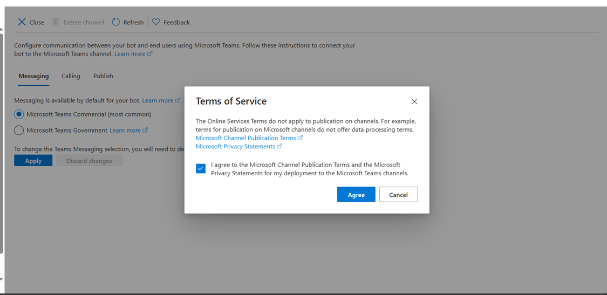

Luego hay que seleccionar la opción `Messaging`. Después seleccionamos `Microsoft Teams Commercial`.
Guardamos los cambios dando clic en el botón de `Apply`.
Ahora nos deberá de aparecer la opción de teams en la pantalla de **Channels**.
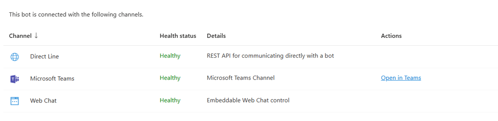

---
### Key Vault
Así aparece en el buscador:
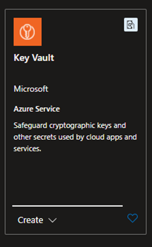

Una vez al darle `Create`, nos va a dirigir a la siguiente pantalla:
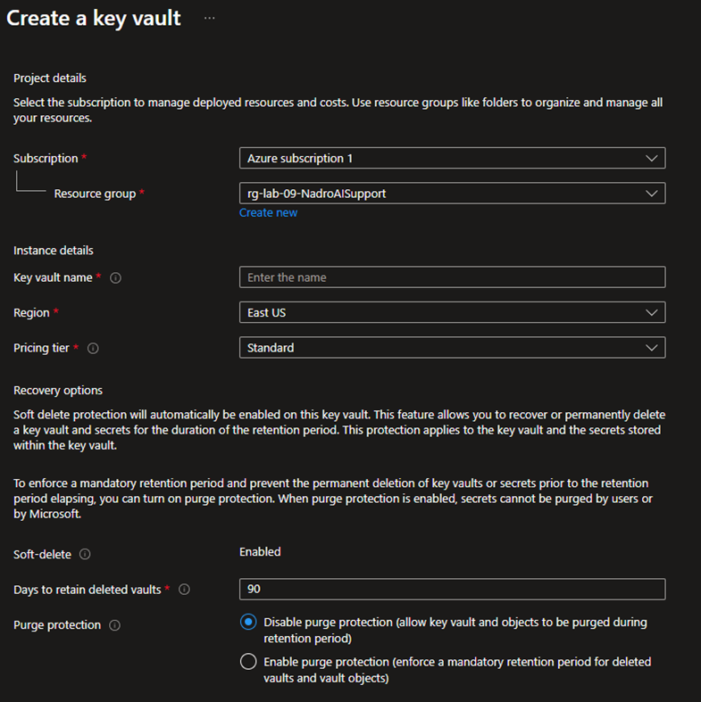

<table>
  <thead>
    <tr>
      <th>Campo</th>
      <th>Configuración</th>
    </tr>
  </thead>
  <tbody>
    <tr>
      <td>Subscription</td>
      <td>Elegimos la subscripción para nuestro recurso.</td>
    </tr>
    <tr>
      <td>Resource Group</td>
      <td>Elegimos el grupo de recursos donde estará el Key vault.</td>
    </tr>
    <tr>
      <td>Key vault name</td>
      <td>Nombre del recurso. Sigamos la nomenclatura definida, en este caso: kv-cagent-XX-%RANDOM%</td>
    </tr>
    <tr>
      <td>Region</td>
      <td>Puede ser:
	  	<ul>
        <li>East US</li>
        <li>East US 2</li>
        <li>South Central US</li>
		  </ul>
	    </td>
    </tr>
    <tr>
      <td>Pricing tier</td>
      <td>Standard</td>
    </tr>
    <tr>
      <td>Days to retain deleted vaults</td>
      <td>90</td>
    </tr>
    <tr>
      <td>Purge protection</td>
      <td>Disable purge protection (allow key vault and objects to be purged during retention period)</td>
    </tr>
  </tbody>
</table>

> [!NOTE]
> Las demás configuraiones (Access configuration, Networking, etc) se dejan con sus valores por defecto.

#### Plantilla para secretos
🟠 Solo se configura si son necesarios con ese agente. <br>
🟡 Obsoletos, no necesarios en esta versión.

<table>
  <thead>
    <tr>
      <th>Secret Name</th>
      <th>Value</th>
    </tr>
  </thead>
  <tbody>
    <tr class="secret-optional">
      <td>🟠AI-SEARCH-SERVICE-KEYY</td>
      <td>"YOUR_VALUE_HERE"</td>
    </tr>
	  <tr>
      <td>APP-ID</td>
      <td>
	   	"YOUR_VALUE_HERE",<br>
	    Azure Bot → Settings → Configuration → Microsoft App ID
	    </td>
    </tr>
    <tr class="secret-optional">
      <td>🟠APP-PASSWORD</td>
      <td>"none"</td>
    </tr>
    <tr>
      <td>AUTH-TYPE</td>
      <td>"YOUR_VALUE_HERE",  UserManagedIdentity</td>
      </tr>
    <tr>
      <td>AZURE-COSMOSDB-CONTAINER-HISTORY-NAME</td>
      <td>
        "YOUR_VALUE_HERE",<br>
        cagent_history_dev <br>
        cagent_history_prod
      </td>
      </tr>
    <tr>
      <td>AZURE-COSMOSDB-ENDPOINT</td>
      <td>Cosmos → Settings → Keys → URI</td>
    </tr>
    <tr>
      <td>AZURE-COSMOSDB-KEY</td>
      <td>Cosmos → Settings → Keys → Primary Key¬ → Settings → Identity → Primary Key</td>
    </tr>
    <tr>
      <td>AZURE-COSMOSDB-DATABASE-HISTORY-NAME</td>
      <td> 
        "YOUR_VALUE_HERE", <br>
        History
      </td>
    </tr>
    <tr>
      <td>AZURE-COSMOSDB-DATABASE-REACTIONS-NAME</td>
      <td> 
        "YOUR_VALUE_HERE", <br>
        Reactions
      </td>
    </tr>
    <tr>
      <td>AZURE-COSMOSDB-CONTAINER-REACTIONS-NAME</td>
      <td> 
        "YOUR_VALUE_HERE", <br>
        cagent_reactions_dev <br>
        cagent_reactions_prod
      </td>
    </tr>
    <tr class="secret-deprecated">
      <td>🟡AZURE-OPENAI-API-KEY2</td>
      <td>"YOUR_VALUE_HERE",</td>
    </tr>
    <tr>
      <td>AZURE-OPENAI-API-KEYY</td>
      <td>
        YOUR_VALUE_HERE", <br>
        Foundry → Foundry Portal → Mis recursos → Modelos + Puntos de conexión → Clave
      </td>
    </tr>
    <tr class="secret-deprecated">
      <td>🟡AZURE-OPENAI-ENDPOINT2</td>
      <td>"YOUR_VALUE_HERE",</td>
    </tr>
    <tr>
      <td>AZURE-OPENAI-ENDPOINTT</td>
      <td>
        YOUR_VALUE_HERE", <br>
        Foundry → Foundry Portal → Mis recursos → Modelos + Puntos de conexión → URI
      </td>
    </tr>
    <tr class="secret-deprecated">
      <td>🟡AZURE-OPENAI-MODEL-NAME2</td>
      <td>"YOUR_VALUE_HERE",</td>
    </tr>
    <tr>
      <td>AZURE-OPENAI-MODEL-NAMEE</td>
      <td>
        YOUR_VALUE_HERE", <br>
        Foundry → Foundry Portal → Mis recursos → Modelos + Puntos de conexión → Nombre del modelo que estemos utilzando.
      </td>
    </tr>
    <tr class="secret-optional">
      <td>🟠AZURE-SEARCH-API-VERSIONN</td>
      <td>"YOUR_VALUE_HERE",</td>
    </tr>
    <tr class="secret-optional">
      <td>🟠AZURE-SEARCH-ENDPOINTT</td>
      <td>"YOUR_VALUE_HERE",</td>
    </tr>
    <tr>
      <td>blob-connection-string</td>
      <td>
        YOUR_VALUE_HERE", <br>
        Storage Account → Security + Networking → Access Keys → Connection String
      </td>
    </tr>
    <tr>
      <td>blob-container-name</td>
      <td>
        YOUR_VALUE_HERE", <br>
        Storage Account → Container → Nombre del contenedor que estemos utilizando.
      </td>
    </tr>
    <tr>
      <td>blob-sas-token</td>
      <td>
        YOUR_VALUE_HERE", <br>
        Storage Account → Security + Networking → Shared Access Signature → Generate SAS and connection string → SAS token (Agregar un signo "?" al inicio (Sin comillas)) 
      </td>
    </tr>
    <tr>
      <td>MICROSOFTAPPTENANTID</td>
      <td>
        YOUR_VALUE_HERE", <br>
        Azure Bot → Settings → Configuration → App Tenant ID
      </td>
    </tr>
    <tr>
      <td>OPENAI-SERVICE-IDD</td>
      <td>"YOUR_VALUE_HERE",</td>
    </tr>
    <tr>
      <td class="table-inner-title" colspan="2">Configuraciones si utiliza SQL</td>
    </tr>
    <tr>
      <td>sql-database-nombredelagente</td>
      <td>"YOUR_VALUE_HERE",</td>
    </tr>
    <tr>
      <td>sql-password-nombredelagente</td>
      <td>"YOUR_VALUE_HERE",</td>
    </tr>
    <tr>
      <td>sql-server-nombredelagente</td>
      <td>"YOUR_VALUE_HERE",</td>
    </tr>
    <tr>
      <td>sql-username-nombredelagente</td>
      <td>"YOUR_VALUE_HERE",</td>
    </tr>
    <tr>
      <td class="table-inner-title" colspan="2">Configuraciones si utiliza Fabric</td>
    </tr>
    <tr>
      <td>FABRIC-DATABASE-nombredelagente</td>
      <td>
        YOUR_VALUE_HERE", <br>
        Nombre del Lakehouse en Fabric
      </td>
    </tr>
    <tr>
      <td>FABRIC-ENDPOINT-nombredelagente</td>
      <td>
        YOUR_VALUE_HERE", <br>
        Fabric → Lakehouse → Configuración → Punto de conexión de análisis SQL
      </td>
    </tr>
    <tr>
      <td class="table-inner-title" colspan="2">Configuraciones si utiliza Web Agent</td>
    </tr>
    <tr>
      <td>BING-AGENT-ID-web</td>
      <td>
        YOUR_VALUE_HERE", <br>
        Foundry → Foundry Portal → Agentes → ID
      </td>
    </tr>
    <tr>
      <td>BING-API-KEY-web</td>
      <td>
        YOUR_VALUE_HERE", <br>
        Grounding with bing → Research management → Keys → Key 1
      </td>
    </tr>
    <tr>
      <td>BING-ENDPOINT-web</td>
      <td>
        YOUR_VALUE_HERE", <br>
        Foundry → Foundry Portal → Agentes → Agente → Probar en el área de juegos → Ver código → Punto de conexión (hasta abajo)
      </td>
    </tr>
  </tbody>
</table>

> [!IMPORTANT]
> Si utiliza Fabric, hay que concederle permiso para poder acceder a la información.

**¿Cómo conceder permisos en Fabric?**
Solo puede hacerlo el administrador del entorno de Fabric.

Ir al área de trabajo y seleccionar `Manage access`.
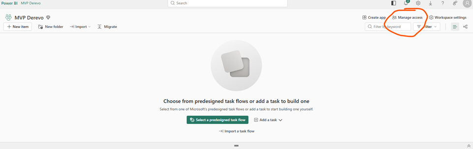

Hay que añadir el App Service Plan.
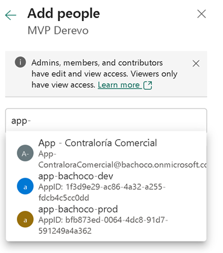

---

### Container Registry
Dentro del Microsoft Azure Marketplace, al buscar en el navegador **Container Registry**:
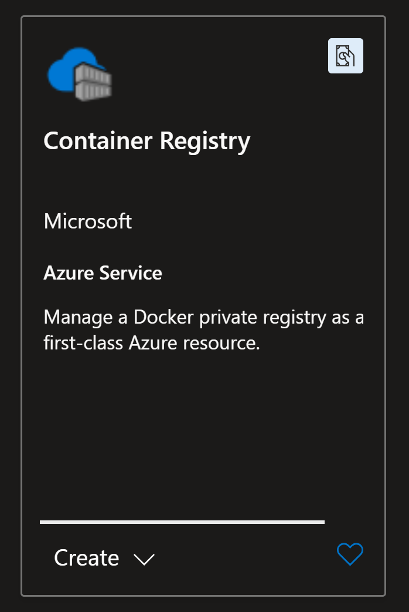

Al darle "Create", nos dirige a la siguiente pantalla:
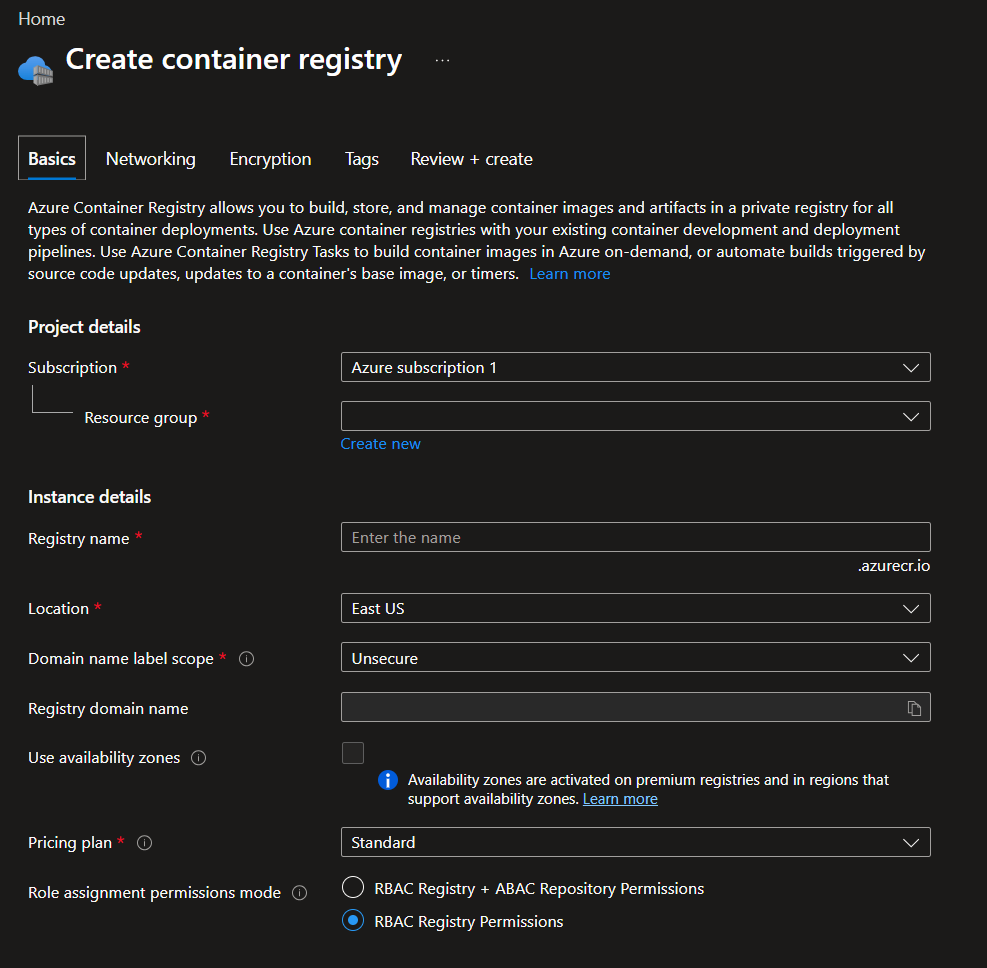

<table>
  <thead>
    <tr>
      <th>Campo</th>
      <th>Configuración</th>
    </tr>
  </thead>
  <tbody>
    <tr>
      <td>Subscription</td>
      <td>Elegimos la subscripción para nuestro recurso</td>
    </tr>
    <tr>
      <td>Resource Group</td>
      <td>Elegimos el grupo de recursos donde estará el Container Registry</td>
    </tr>
    <tr>
      <td>Registry Name</td>
      <td>Nombre del recurso. Sigamos la nomenclatura definida, en este caso: <b>accragent-%RANDOM%</b></td>
    </tr>
    <tr>
      <td>Location</td>
      <td>Puede ser East US, East US 2, South Central US</td>
    </tr>
    <tr>
      <td>Domain name label scope</td>
      <td>Unsecure</td>
    </tr>
    <tr>
      <td>Pricing Plan</td>
      <td>Standard</td>
    </tr>
    <tr>
      <td>Role assignment permissions mode</td>
      <td>RBAC Registry Permissions</td>
    </tr>
  </tbody>
</table>

---

### Azure AI Foundry

Dentro del Microsoft Azure Marketplace, al buscar en el navegador **Microsoft Foundry**:

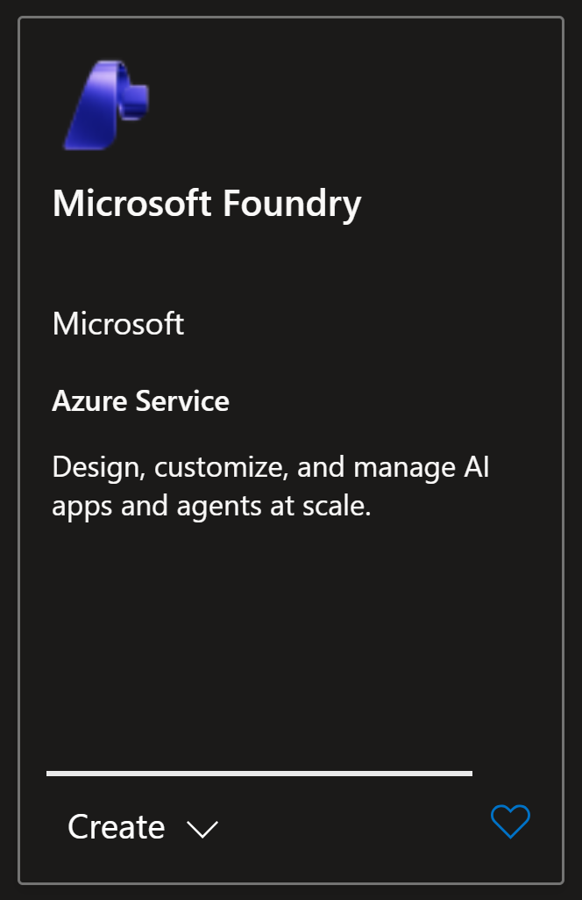

Al darle "Create", nos dirige a la siguiente pantalla:

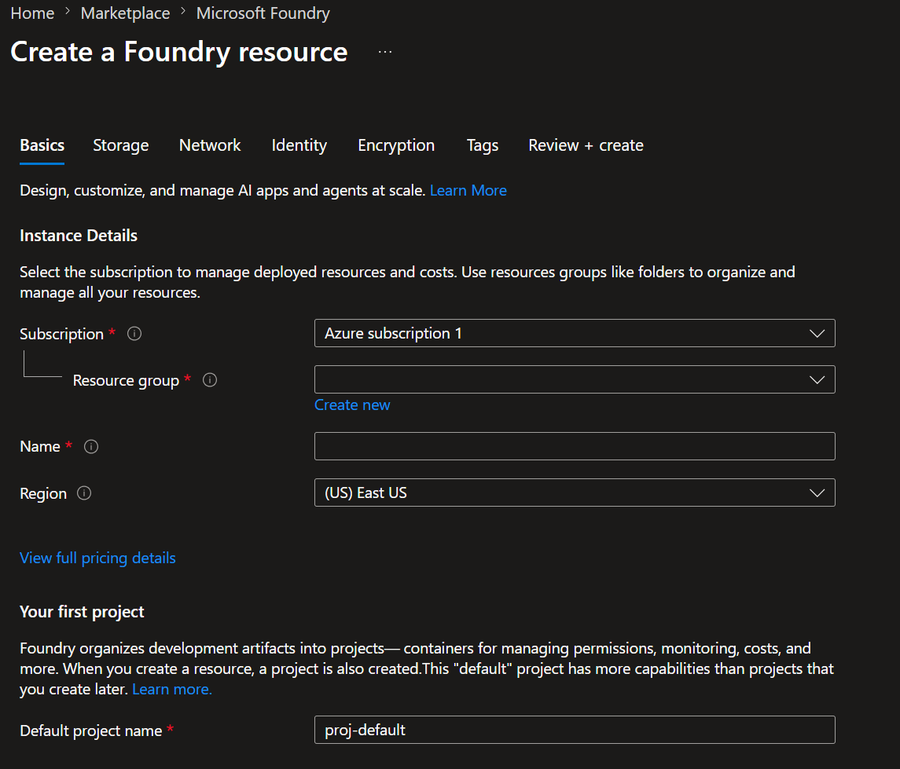

<table>
  <thead>
    <tr>
      <th>Nombre Campo</th>
      <th>Configuración</th>
    </tr>
  </thead>
  <tbody>
    <tr>
      <td>Resource Group</td>
      <td>Elegimos el grupo de recursos donde estará el Container Registry</td>
    </tr>
    <tr>
      <td>Name</td>
      <td>Nombre del recurso. Sigamos la nomenclatura definida, en este caso: openai-cagent-%RANDOM%</td>
    </tr>
    <tr>
      <td>Location</td>
      <td>Puede ser East US, East US 2, South Central US</td>
    </tr>
    <tr>
      <td>Default Project Name</td>
      <td>openai-cagent-%RANDOM%</td>
    </tr>
    <tr>
      <td>Network - Inbound Access</td>
      <td>Dejamos por defecto la opción: All networks, including the internet, can access this resource</td>
    </tr>
    <tr>
      <td>Identity - Identity Type</td>
      <td>Dejamos por defecto la opción de: System Assigned</td>
    </tr>
    <tr>
      <td>Data Encryption</td>
      <td>Dejamos por defecto sin habilitar la opción: Encrypt data using a customer-managed key</td>
    </tr>
  </tbody>
</table>

> [!NOTE]
> **Azure Foundry sigue en constante actualización. Es posible que se generen dos nuevos recursos relacionados a Foundry**
> 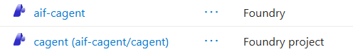

#### Configuración Azure Foundry: Creación de Modelo

En el portal principal de azure, nos dirigimos a **Foundry**:

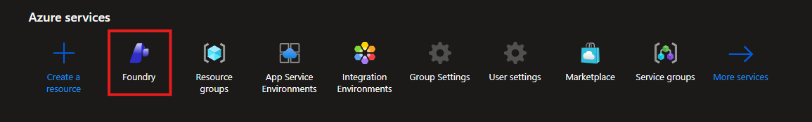

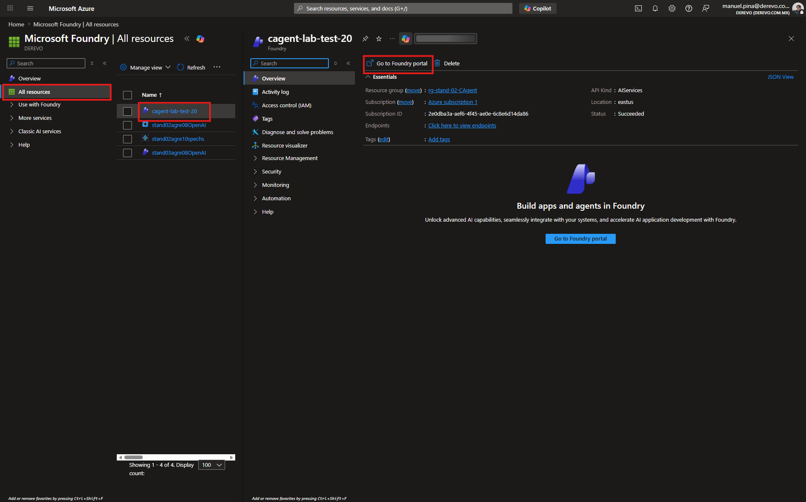

1. Seleccione **All Resources** en el panel lateral izquierdo.
2. Haga clic en **Nombre del Foundry** creado.
3. Busque y haga click en **Go to Foundry Portal**.

Nos dirigimos al panel lateral izquierda en busca de "Models + endpoints":

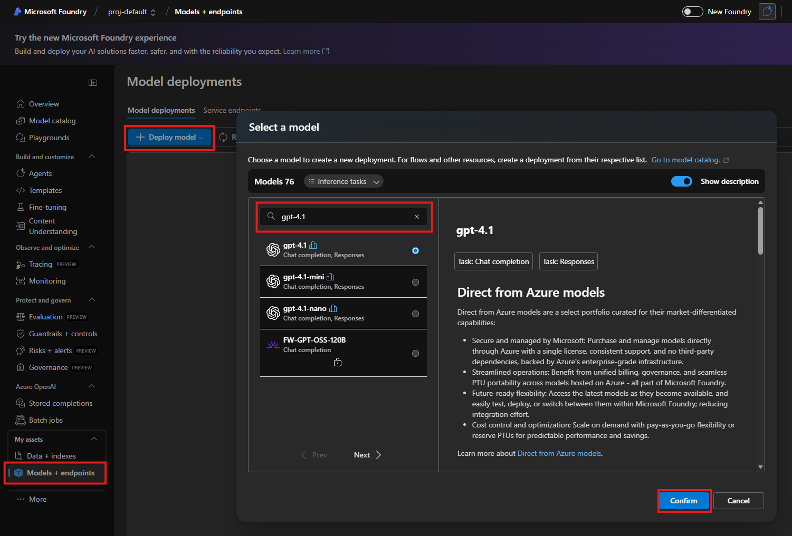
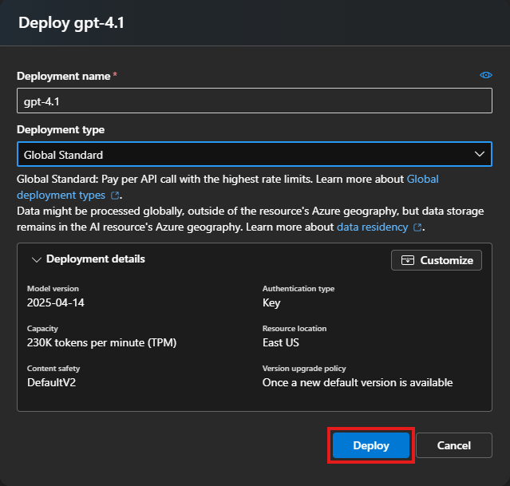

**Nota: Hay que asegurarse de no tener habilitada la funcion "New Foundry" arriba a la derecha**

1. Seleccione **Deployments** en el panel lateral izquierdo.
2. Haga clic en **+ Deploy model**.
3. Busque y seleccione el modelo **GPT-4.1**, luego haga clic en **Confirm**.
4. Haga click en **Deploy**.

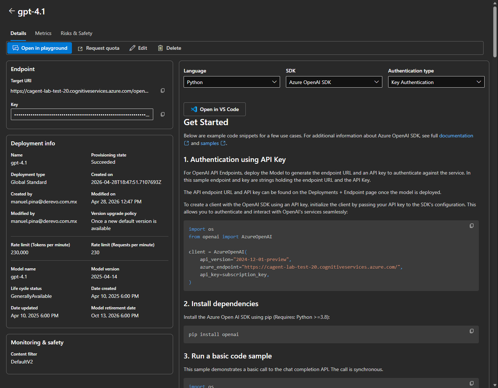

### Log Analytics Workspace

Dentro del Microsoft Azure Marketplace, al buscar en el navegador **Log Analytics Workspace**:

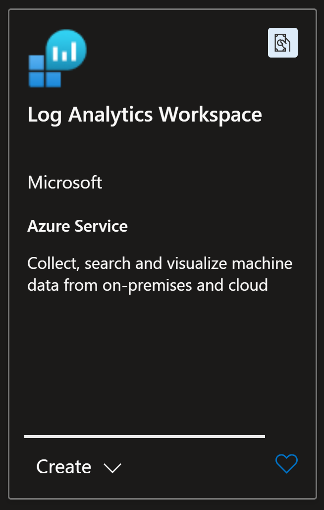

Dentro del menu de creación nos aparecerá lo siguiente:

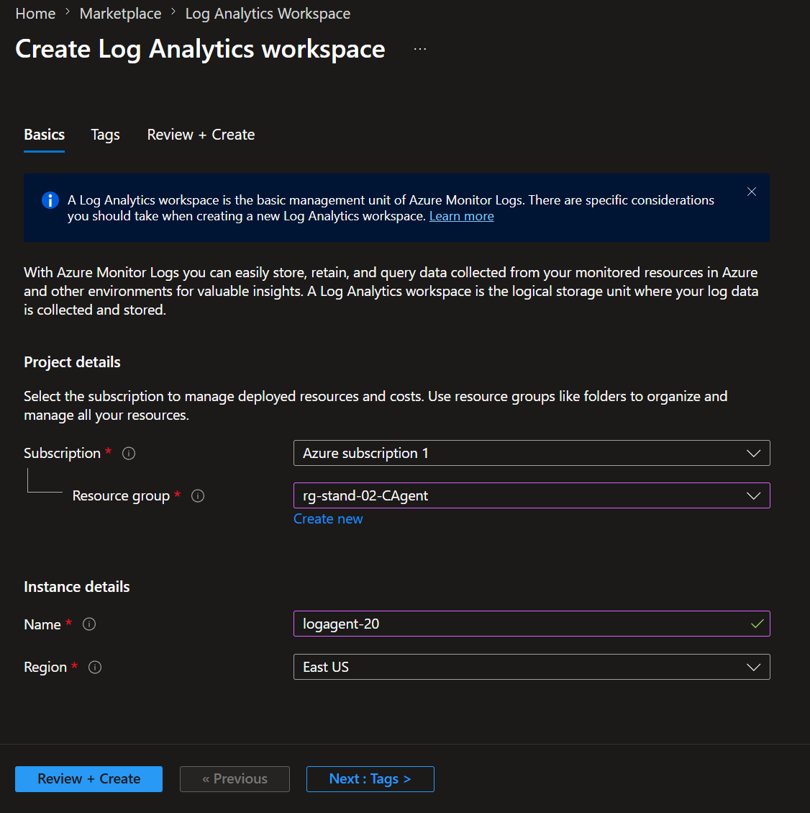

<table>
  <thead>
    <tr>
      <th>Nombre Campo</th>
      <th>Configuración</th>
    </tr>
  </thead>
  <tbody>
    <tr>
      <td>Subscription</td>
      <td>Elegimos la subscripción para nuestro recurso</td>
    </tr>
    <tr>
      <td>Resource Group</td>
      <td>Elegimos el grupo de recursos donde estará el Log Analytics</td>
    </tr>
    <tr>
      <td>Name</td>
      <td>Nombre del recurso. Sigamos la nomenclatura definida, en este caso: <b>logagent-%RANDOM%</b></td>
    </tr>
    <tr>
      <td>Location</td>
      <td>Puede ser East US, East US 2, South Central US</td>
    </tr>
  </tbody>
</table>

### Storage Account

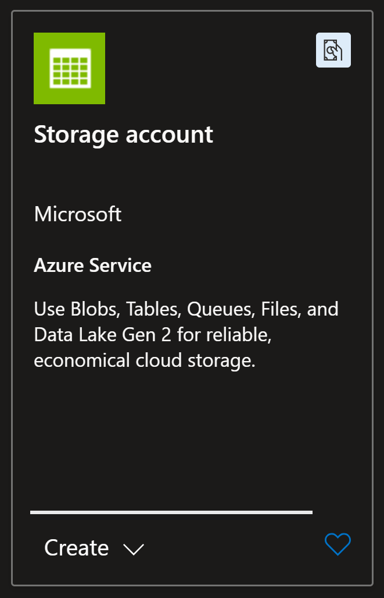

Dentro del menu de creación nos aparecerá lo siguiente:

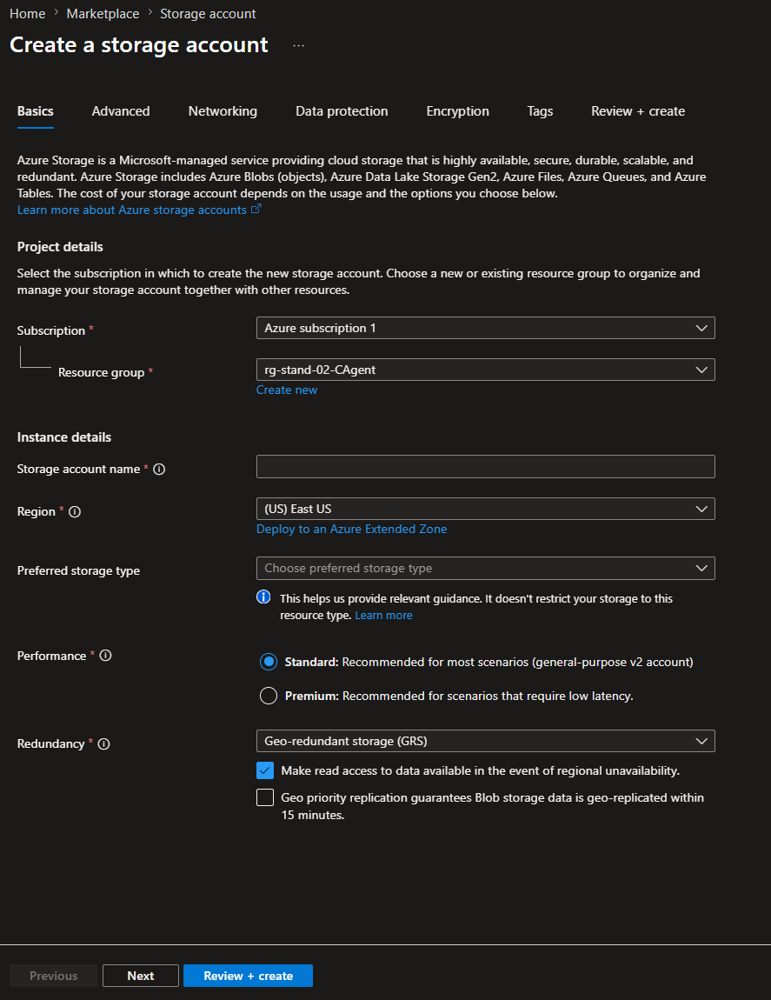

<table>
  <thead>
    <tr>
      <th>Nombre Campo</th>
      <th>Configuración</th>
    </tr>
  </thead>
  <tbody>
    <tr>
      <td>Subscription</td>
      <td>Elegimos la subscripción para nuestro recurso</td>
    </tr>
    <tr>
      <td>Resource Group</td>
      <td>Elegimos el grupo de recursos donde estará el Azure AI Foundry</td>
    </tr>
    <tr>
      <td>Name</td>
      <td>Nombre del recurso. Sigamos la nomenclatura definida, en este caso: <b>sacagent02%RANDOM%</b></td>
    </tr>
    <tr>
      <td>Region</td>
      <td>Puede ser East US, East US 2, South Central US</td>
    </tr>
    <tr>
      <td>Preferred storage type</td>
      <td>Azure blob storage or Azure data lake storage gen 2</td>
    </tr>
    <tr>
      <td>Performance</td>
      <td>Standard</td>
    </tr>
    <tr>
      <td>Redundancy</td>
      <td>Locally-redundant storage (LRS)</td>
    </tr>
  </tbody>
</table>

#### Configuración Storage Account

En el portal principal de azure, nos dirigimos al container creado:

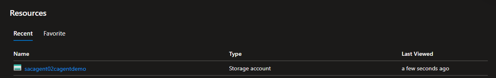
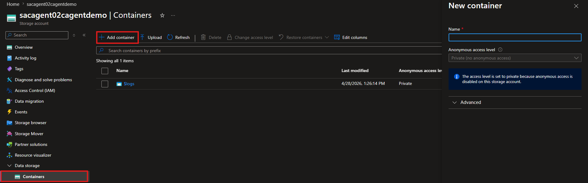

1. Seleccione **Data Storage** en el panel lateral izquierdo.
2. Haga clic en **Containers**.
3. Busque y haga click en **Add Container**.

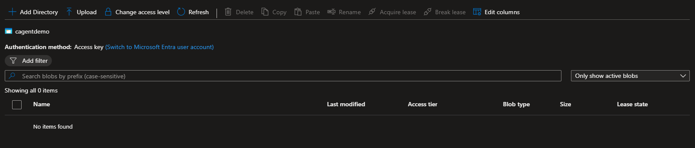

> [!IMPORTANT]
> Acceda al contenedor recién creado. Utilice la opción **Add directory** para crear la estructura de carpetas necesaria y cargue los archivos JSON de configuración más recientes del C-Agent en sus directorios correspondientes (asegúrese de solicitar las versiones actualizadas previamente).

#### Configuración Storage Account: SAS TOKEN

Para generar el token SAS, navegue dentro de su **Storage account** hacia la sección **Security + networking** y seleccione **Shared access signature**. Esto abrirá la ventana de configuración correspondiente.

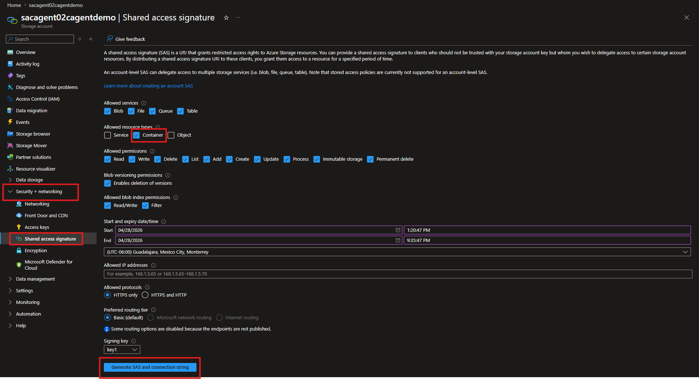

A menos de que estemos generando algo muy específico, dejamos todos valores por default. Le damos click a container. De preferencia dejar las fechas de start y end en un año. Le damos click a Generate SAS.

Abajo se encuentra una tabla con los secretos que tienen que ser validados y donde se encuentran.

<table>
  <thead>
    <tr>
      <th>Secret Name</th>
      <th>Lugar</th>
    </tr>
  </thead>
  <tbody>
    <tr>
      <td>blob-connection-string</td>
      <td>Storage Account → Access key → Connection Strings</td>
    </tr>
    <tr>
      <td>blob-container-name</td>
      <td>Storage Account → Container → Nombre del container que estemos usando</td>
    </tr>
    <tr>
      <td>blob-sas-token</td>
      <td>"YOUR_VALUE_HERE"</td>
    </tr>
  </tbody>
</table>

### Azure Cosmos DB

Dentro del Microsoft Azure Marketplace, al buscar en el navegador **Azure Cosmos DB**:

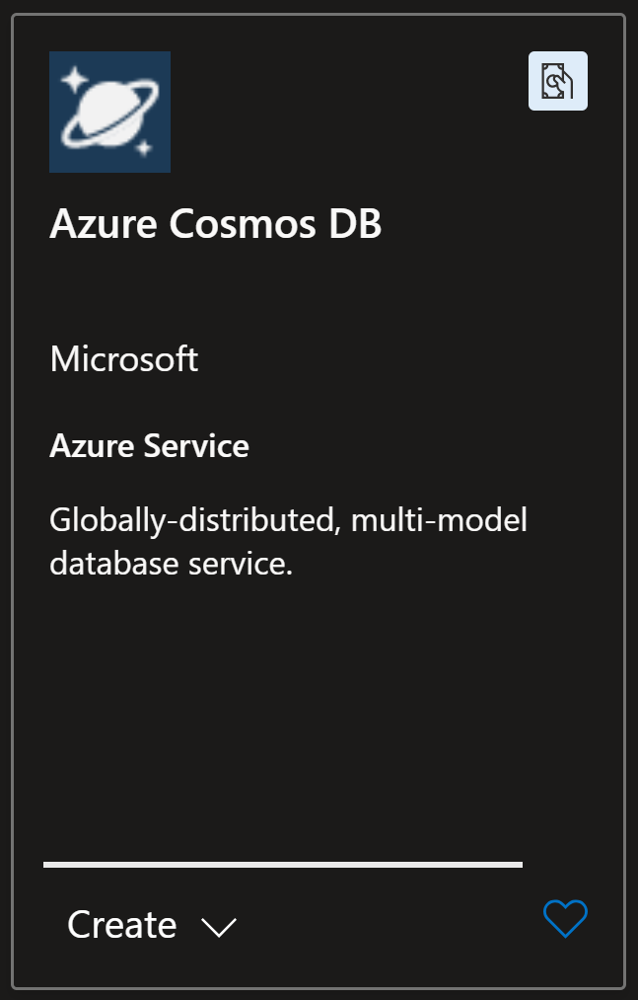

Antes de poder crearlo nos va a dar a escoger entre dos opciones, hay que escoger la opción de Azure Cosmos DB for NoSQL.

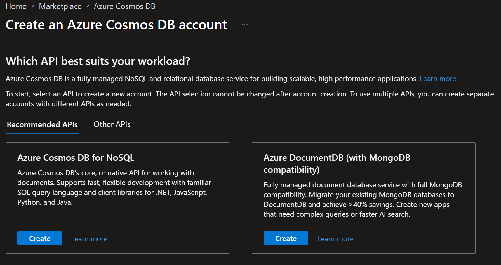

Después de escoger el tipo, nos aparecerá una nueva ventana, donde tendremos que configurar las diferentes opciones.

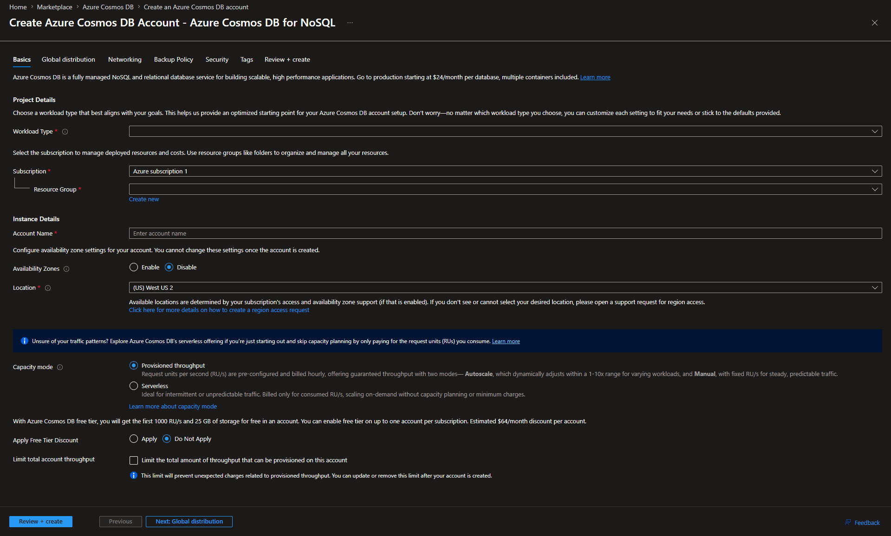

Esta es la configuración en la opción de Basics:

<table>
  <thead>
    <tr>
      <th>Secret Name</th>
      <th>Lugar</th>
    </tr>
  </thead>
  <tbody>
    <tr>
      <td>Workload Type</td>
      <td>Development / Testing</td>
    </tr>
    <tr>
      <td>Subscription</td>
      <td>Elegimos la subscripción para nuestro recurso</td>
    </tr>
    <tr>
      <td>Resource Group</td>
      <td>Elegimos el grupo de recursos donde estará el Azure AI Foundry</td>
    </tr>
    <tr>
      <td>Account Name</td>
      <td>Nombre del recurso. Sigamos la nomenclatura definida, en este caso: <b>cosmos-cagent-%RANDOM%</b></td>
    </tr>
    <tr>
      <td>Availability Zones</td>
      <td>Marcar como <b>Disable</b></td>
    </tr>
    <tr>
      <td>Location</td>
      <td>Puede ser East US, East US 2, South Central US</td>
    </tr>
    <tr>
      <td>Capacity Mode</td>
      <td>En la mayoría de los casos: Provisioned throughput. Si es un demo y no tienes cosmo: <b>Serverless</b></td>
    </tr>
    <tr>
      <td>Apply Free Tier Discount</td>
      <td>Marcar en <b>Apply</b></td>
    </tr>
    <tr>
      <td>Limit Total Account Discount</td>
      <td>Marcar con una palmoita</td>
    </tr>
  </tbody>
</table>

#### Configuración Cosmos DB

Una vez dentro del recurso Cosmos DB recién creado, diríjase al **Data Explorer**. En el menú, seleccione **+ New Container** e ingrese la siguiente configuración:

1. Database id: Asigne un nombre a la base de datos o seleccione una existente.
2. Container id: Ingrese un identificador único para el nuevo contenedor.
3. Partition key* Debe ser obligatoriamente `/user_id`.

Puede verificar estos nombres y valores en el recurso **Key Vault**. Para ello, vaya a la sección **Secrets**, seleccione el secreto deseado (por ejemplo, `AZURE-COSMOSDB-CONTAINER-NAME`), haga clic en la versión actual y seleccione **Show secret value**.

La siguiente tabla describe los secretos requeridos de Cosmos DB y su representación:

<table>
  <thead>
    <tr>
      <th>Secret Name</th>
      <th>Representación dentro del Cosmos DB</th>
    </tr>
  </thead>
  <tbody>
    <tr>
      <td>AZURE-COSMOSDB-CONTAINER-NAME</td>
      <td>Nombre del container</td>
    </tr>
    <tr>
      <td>AZURE-COSMOSDB-ENDPOINT</td>
      <td>Endpoint</td>
    </tr>
    <tr>
      <td>AZURE-COSMOSDB-KEY</td>
      <td>Primary key</td>
    </tr>
    <tr>
      <td>AZURE-COSMOSDB-NAME</td>
      <td>Nombre de la base de datos</td>
    </tr>
    <tr>
      <td>AZURE-COSMOSDB-NAME-REACTIONS</td>
      <td>Nombre de la base de datos de las reacciones</td>
    </tr>
    <tr>
      <td>AZURE-COSMOSDB-REACTIONS-HISTORY</td>
      <td>Nombre del contenedor de las reacciones</td>
    </tr>
  </tbody>
</table>

---

## Publicar el Agente

### Microsoft Teams

Para llevar a cabo esta guía, es necesario contar con los siguientes prerrequisitos para la creación de la aplicación:

- Bot ID
- Bot Domain (Dominio del Bot)
- Tenant ID (ID del Inquilino)
- Logotipo a color (192 x 192 píxeles)
- Ícono de contorno (32 x 32 píxeles)

### Obtención de credenciales

Las credenciales necesarias se obtienen desde el Portal de Azure, específicamente en la instancia del bot. Siga estos pasos para recopilar la información:

1. Acceda al [Portal de Azure](https://portal.azure.com/#home).
2. Diríjase a la sección de **Grupos de recursos (Resource groups)**.

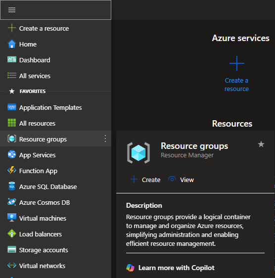

3. Seleccione el grupo de recursos donde se encuentra alojado el bot.
4. Elija el recurso del bot que se utilizará para la aplicación.
5. En el menú lateral, vaya a la sección **Settings** y seleccione **Configuration**.

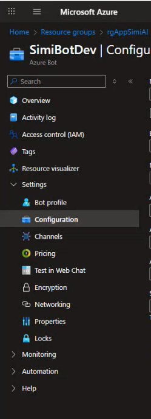

6. Copie y guarde el valor de **Microsoft App ID** (este será el *Bot ID* para los siguientes pasos). Asimismo, identifique el **Messaging endpoint** y extraiga únicamente el dominio. 
   - *Ejemplo de dominio:* `https://<domain_bot>.azurewebsites.net`

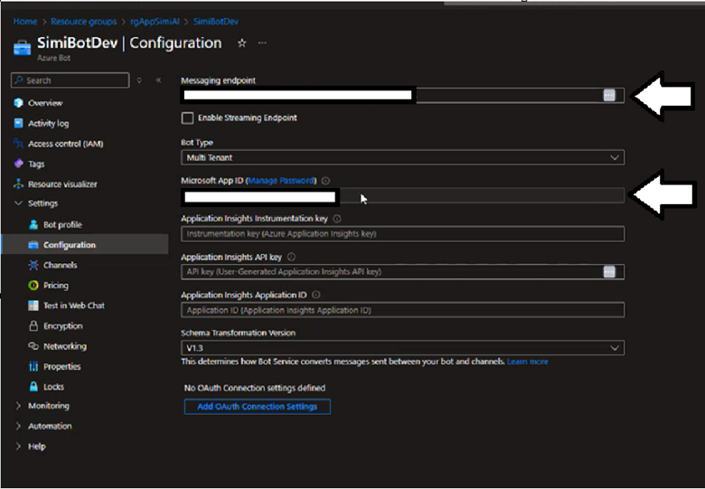

7. Abra una consola de **PowerShell** integrada en el Portal de Azure haciendo clic en el ícono correspondiente en la barra superior (Topbar).

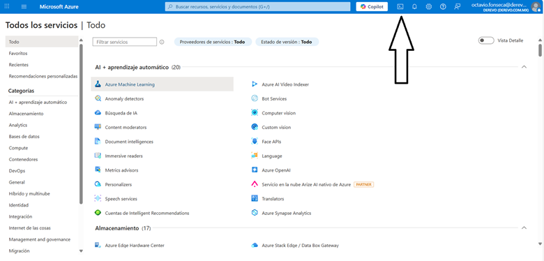

8. Ejecute el comando `Get-AzContext` y guarde el valor correspondiente al **Tenant** (*Tenant ID*).

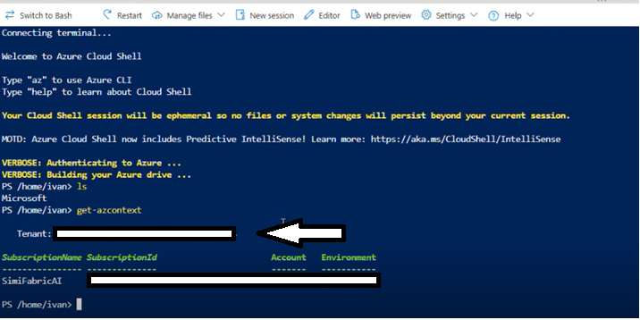

### Configuración en Visual Studio Code (VS Code)

**Repositorio base:** `DerevoDataScience/TeamsAppZip`
Este repositorio utiliza **Microsoft 365 Agent Toolkit** para automatizar la generación de paquetes (archivos `.zip`) destinados a los agentes de Microsoft Teams.

1. **Instalación de la extensión:**
   Busque e instale la extensión **Microsoft 365 Agents Toolkit** dentro de su entorno de Visual Studio Code.

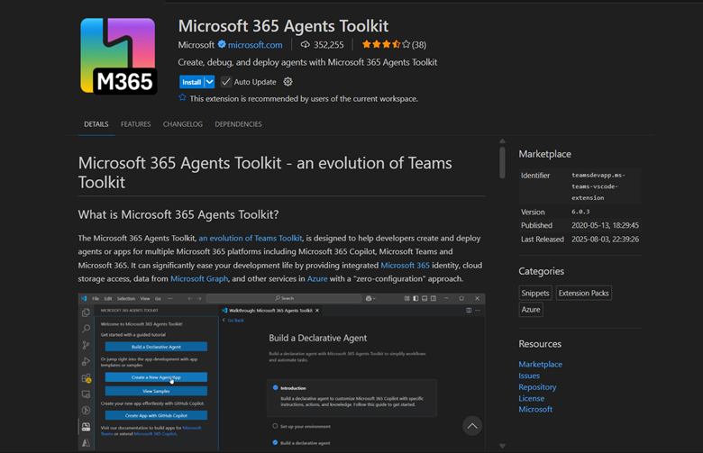

2. **Configuración del directorio `appPackage`:**
   Deberá crear o modificar la carpeta denominada `appPackage`. Este directorio debe incluir el archivo `manifest.json` (su estructura se detallará más adelante) y las imágenes correspondientes a la aplicación. 
   
   Es fundamental seguir las siguientes especificaciones técnicas para los íconos:

   **A. Ícono a color (Color):**
   - Resolución total: 192 x 192 píxeles.
   - El logotipo principal debe estar centrado y tener una dimensión exacta de 96 x 96 píxeles.
   - Debe contar con un margen (*padding*) de 48 píxeles entre el logotipo y el borde de la imagen.

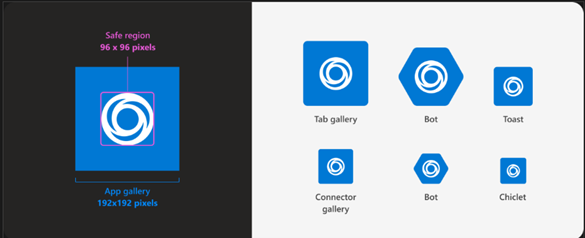
*Referencia: 1_img_Color_192x192px*

   **B. Ícono de contorno (Icon):**
   - Resolución total: 32 x 32 píxeles.
   - El diseño puede configurarse en color blanco con fondo transparente, o diseño transparente con fondo blanco.

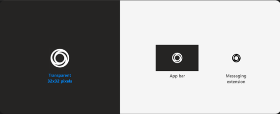

> Para consultar especificaciones más detalladas sobre los requerimientos visuales, visite la documentación oficial: [Package your app - Teams | Microsoft Learn](https://learn.microsoft.com/en-us/microsoftteams/platform/concepts/build-and-test/apps-package).

Al concluir estos pasos, la estructura del directorio `appPackage` deberá visualizarse de la siguiente manera:

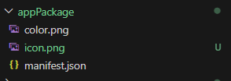

3. **Creación de variables de entorno:**
   Cree una carpeta denominada `env`. Dentro de esta, genere un archivo para almacenar las variables de entorno necesarias para empaquetar la aplicación. El archivo debe nombrarse estrictamente con el formato `.env.<nombre_asignado>` para vincularse correctamente con el archivo `manifest.json`.

   El archivo debe contener las siguientes variables:
   - `APP_NAME_SUFFIX`: Nombre asignado a la aplicación.
   - `TEAMS_APP_ID`: Identificador único de la aplicación. Puede generarse aleatoriamente, pero debe cumplir estrictamente con el formato UUID (ejemplo: `eb488c8a-ab45-483e-8697-2edc6d244999` o la expresión regular `^[0-9a-fA-F]{8}-([0-9a-fA-F]{4}-){3}[0-9a-fA-F]{12}$`).
   - `TEAMS_APP_TENANT_ID`: El valor del *Tenant ID* obtenido previamente desde Azure.
   - `BOT_ID`: El valor del *Microsoft App ID* obtenido en la configuración del bot.
   - `BOT_DOMAIN`: El dominio extraído de la configuración del bot.

   El archivo deberá quedar estructurado de la siguiente forma:

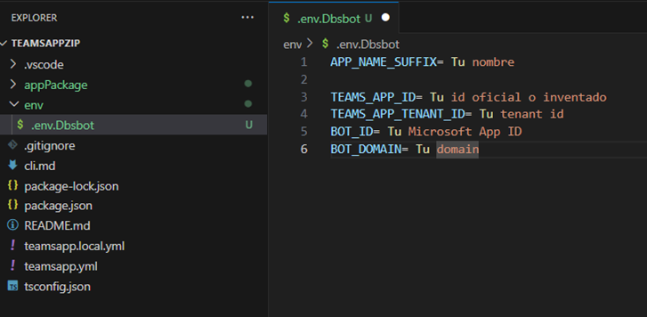

4. **Configuración del archivo `manifest.json`:**
   El archivo `manifest.json` define todas las características y configuraciones de la aplicación. Para consultar el formato completo y los atributos disponibles, revise la documentación oficial: [App Manifest Reference - Teams | Microsoft Learn](https://learn.microsoft.com/en-us/microsoftteams/platform/resources/schema/manifest-schema).
   
   A continuación, se ilustra un ejemplo de cómo quedaría el archivo integrando las variables de entorno configuradas:

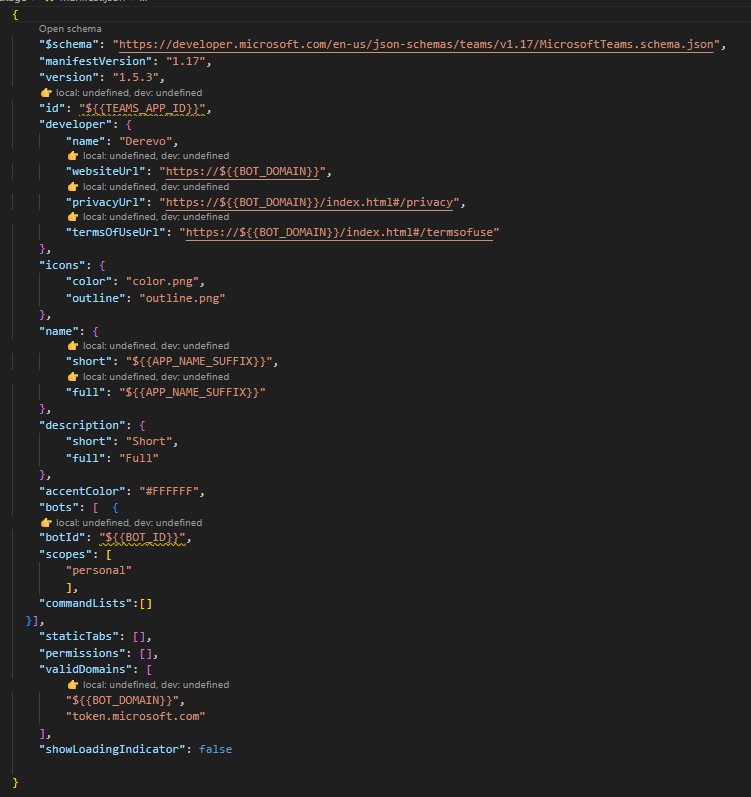

5. **Empaquetado de la aplicación:**
   Una vez validados los pasos anteriores, diríjase a la extensión de *Microsoft 365 Agents Toolkit* y seleccione la opción **Zip App Package**.


Al seleccionarla, el sistema le pedirá que elija el entorno a utilizar (en caso de tener múltiples configurados) y el archivo *manifest*.

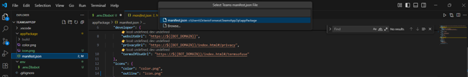

Con el manifiesto y el entorno definidos, la herramienta generará la carpeta `build`, la cual contendrá el paquete `.zip` necesario para su posterior validación en el portal web.

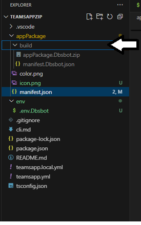

## Validación de la aplicación en el Portal de la aplicación en el Portal Web

Con el paquete `.zip` generado, el siguiente paso es realizar la validación y corrección de posibles errores.
Acceda al portal de administración: [Developer Portal for Teams](https://dev.teams.microsoft.com/).

> [!CAUTION]
> **Nota sobre el control de versiones del portal:** El panel permite alternar entre la versión actual y la versión clásica (anterior) de la interfaz. Se ha detectado que la interfaz nueva puede no manejar los errores de manera detallada (indicando únicamente que ocurrió un fallo general). Si experimenta inconvenientes durante la validación, se recomienda cambiar temporalmente a la versión clásica, la cual mostrará mensajes emergentes (*pop-ups*) con la causa específica del error.

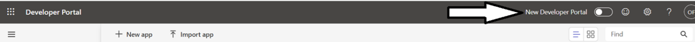

1. **Importar la aplicación:**
   Dentro del portal, seleccione **Import app** y cargue el paquete `.zip` generado desde Visual Studio Code.  
   *Nota:* Asegúrese de que ningún otro usuario en su organización haya registrado previamente una aplicación con exactamente las mismas credenciales (como el *Teams App ID*), ya que esto bloqueará el proceso de importación.

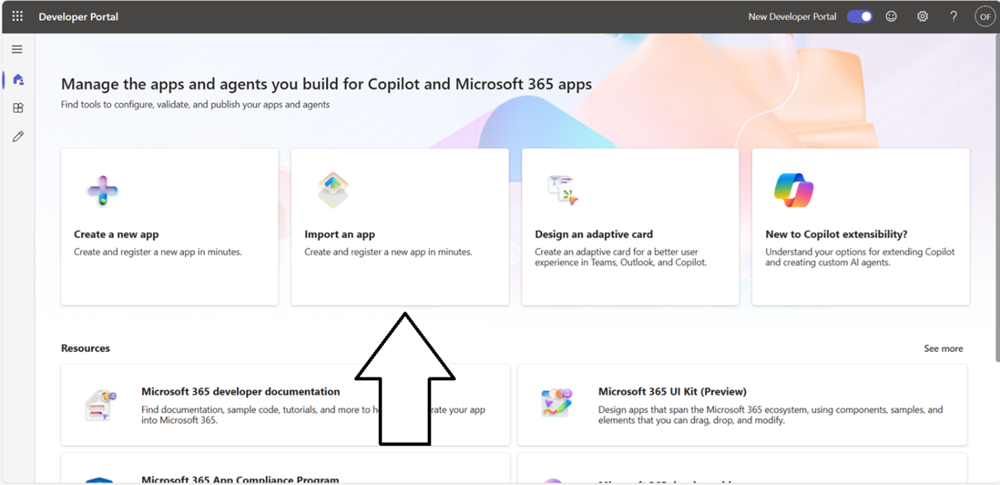
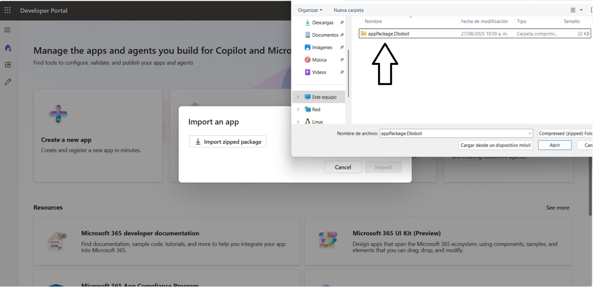

2. **Validar la aplicación:**
   Una vez importada, ingrese al panel de control (Dashboard) de la aplicación. Diríjase a la sección **Publish** (Publicar), haga clic en el botón de **App Validation** (Validación de la aplicación) y luego seleccione **Get Started**. 
   Aparecerá una ventana con diferentes criterios a evaluar (3 *checkboxes*); seleccione todos y proceda a ejecutar la validación.

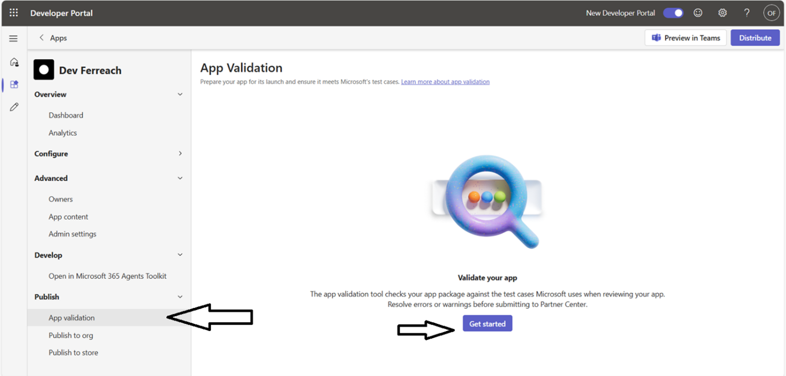
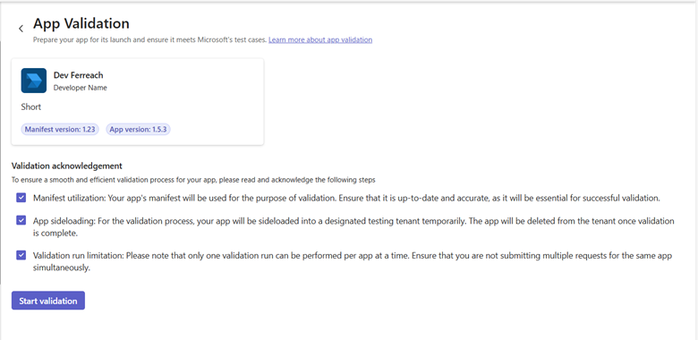
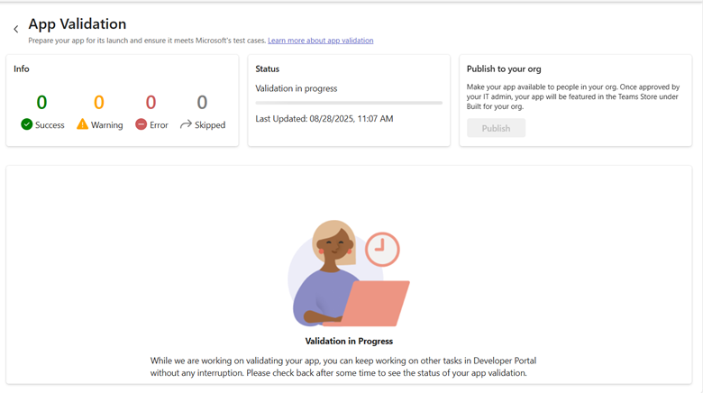